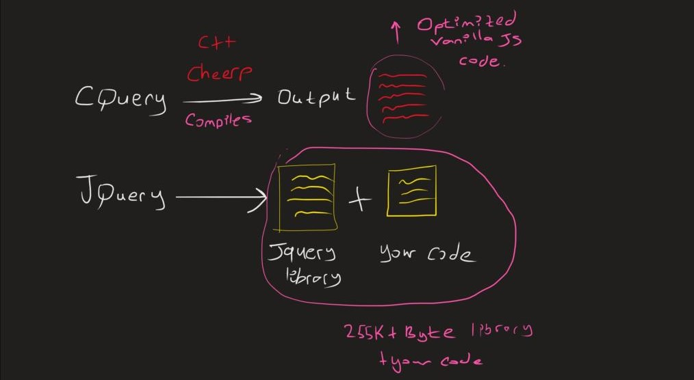

# CQuery
The jquery library has been rewritten in c++/cheerp.

### Usage:

```cpp
void webMain() {
    $(_cb([]{
        client::console.log("HTML Content Loaded, now script will run");
        $("#merhaba").click(_cb([]{
            client::console.log("Clicked Item...!");
        })).click(_cb([]{
            client::console.log("Clicked Again puhahahah...!");
        }));
    }));
}
```

<br>

### Change CSS using Cquery
```html
<div id="appid">
    Lorem ipsum dolor sit amet consectetur adipisicing elit....
</div>
```

```cpp
#include <CQuery.hpp>
void webMain() {
    $("body")
        .css("padding", "0px")
        .css("margin", "0px");
    $("#appid")
        .css("background-color", "red")
        .css("color", "blue")
        .css("width", "500px")
        .css("height", "200px");
}
```

<br>

### What is the difference ?
Cheerp is a compiler, Jquery is a library which which written in javascript. 
    Cquery compiled in Cherpd and generated native javascript output:

Output : 

;


<br>
But, It's a better idea to choose this.
<br>

```cpp
$("#test")
        .css(CSSStyleHelper::BackgroundColor, "red")
        .css(CSSStyleHelper::FontSize, "24pt")
        .css(CSSStyleHelper::Color, "white")
        .css(CSSStyleHelper::Padding, "30px");
```
<br>

### What is the difference ?
Cheerp is a compiler, Jquery is a library which which written in javascript. 
    Cquery compiled in Cheerp and generated native javascript output:

<br>



<br>
<br>

```cpp
$("#test")
        .css(CSSStyleHelper::BackgroundColor, "red")
        .css(CSSStyleHelper::FontSize, "24pt")
        .css(CSSStyleHelper::Color, "white")
        .css(CSSStyleHelper::Padding, "30px");
```

<br>

Generated Output is :

<br>

```js
"use strict";
/*Compiled using Cheerp (R) by Leaning Technologies Ltd*/
var __imul=Math.imul;
var __fround=Math.fround;
var oSlot=0;var nullArray=[null];var nullObj={d:nullArray,o:0};
function _main(){
	var tmp0=null,tmp1=null,tmp2=null,tmp3=null,tmp4=null,tmp5=null;
	tmp0="#test";
	tmp1={a0:null,a1:null};
	tmp1.a1=null;
	tmp1.a0=document.querySelector(tmp0);
	tmp1.a1=tmp0;
	tmp2="red";
	tmp1.a0.style.backgroundColor=tmp2;
	tmp3="24pt";
	tmp1.a0.style.fontSize=tmp3;
	tmp4="white";
	tmp1.a0.style.color=tmp4;
	tmp5="30px";
	tmp1.a0.style.padding=tmp5;
	return 0|0;
}
function _cheerpCreate_ZN6client6StringC2EPKc(Larg0,Marg0){
	var tmp0=null,Lgeptoindexphi=0,tmp2=null;
	tmp0=String();
	Lgeptoindexphi=0;
	while(1){
		tmp2=String.fromCharCode(Larg0[Marg0+Lgeptoindexphi|0]<<24>>24);
		tmp0=tmp0.concat(tmp2);
		Lgeptoindexphi=Lgeptoindexphi+1|0;
		if((Larg0[Marg0+Lgeptoindexphi|0]&255)!==0)continue;
		break;
	}
	return String(tmp0);
}
var _$pstr=new Uint8Array([35,116,101,115,116,0]);
var _$pstr$p1=new Uint8Array([114,101,100,0]);
var _$pstr$p2=new Uint8Array([50,52,112,116,0]);
var _$pstr$p3=new Uint8Array([119,104,105,116,101,0]);
var _$pstr$p4=new Uint8Array([51,48,112,120,0]);
_main();

```

<br>

### Performance ?
Let's look at a performance comparison for the .css method.

C++ version:
```cpp
auto val = 1000;

    auto time1 = client::Date::now();
    for (size_t i = 0; i < val; ++i)
    {
        $("body")
            .css("background-color", "blue")
            .css("width", "500px");
    }   
    auto time2 = client::Date::now();

    client::console.log("Ellapsed time is", time2 - time1);
```

Javascript/Jquery version :
```js

var iteration_size = 1000;

var time1 = +Date.now();
for(var i = 0; i < iteration_size; ++i) {
	$("body")
        .css("background-color", "blue")
        .css("width", "500px");
}
var time2 = +Date.now();

console.log("ellapsed time is : ", time2 - time1);
```

| Browser/Plaform | c++/cquery | js/jquery |
| --------------- | ---------- | --------- |
| Firefox         | ~4ms       | ~11ms     |
| Chrome          | ~6ms       | ~12ms     |


Note: After 1500 the javascript engines can also cut the repeating loops. For higher iterations you can assign values  with math.random.

### Supported Methods

# LICENSE :
See at cheerp license [here](https://github.com/leaningtech/cheerp-utils/blob/master/COPYING)